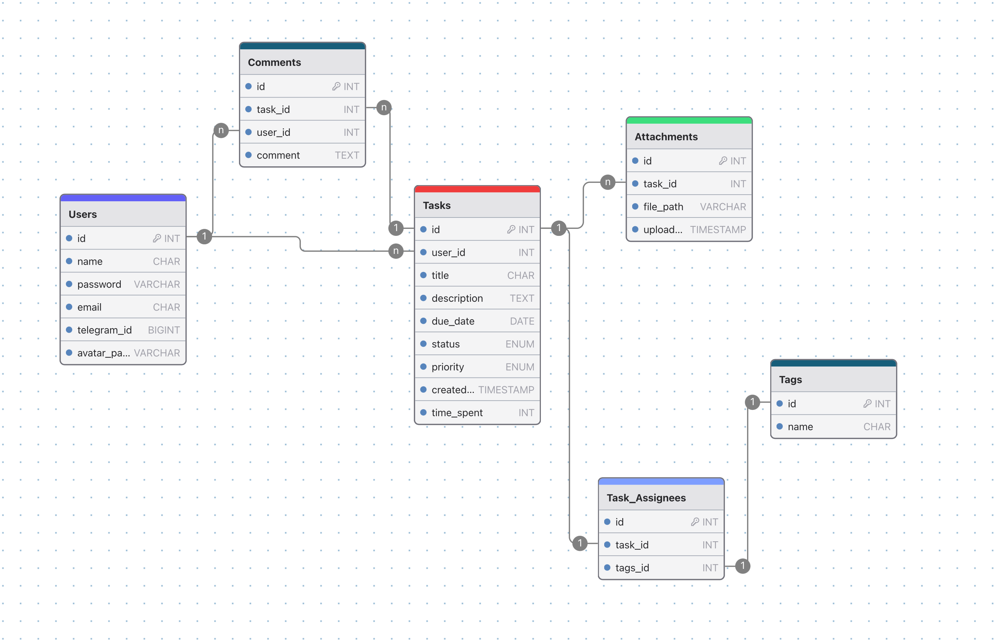

# 🗃️ SQL-schema

База данных: **SQLite**  
Движок: *aiosqlite*

---

## 🧩 Структура базы данных

### 👤 Users

- `id`: `int` — первичный ключ  
- `name`: `char` — логин пользователя (**уникально**)  
- `password`: `varchar` — хешированный пароль  
- `email`: `char` — email для отправки уведомлений *(опционально)*  
- `telegram_id`: `bigint` — Telegram ID пользователя *(опционально)*  
- `avatar_path`: `varchar` — путь до аватарки *(опционально)*  

---

### ✅ Tasks  
**Связь:** многие-к-одному с `Users`

- `id`: `int` — первичный ключ  
- `user_id`: `int` — внешний ключ на `Users.id`  
- `title`: `char` — заголовок задачи  
- `description`: `text` — полное описание *(опционально)*  
- `due_date`: `date` — назначенный день выполнения  
- `status`: `enum` — статус задачи (`open`, `closed`, `in_progress`, `todo`) *(по умолчанию: `open`)*  
- `priority`: `enum` — приоритет (`low`, `medium`, `high`, `critical`)  
- `created_at`: `timestamp` — дата и время создания  
- `time_spent`: `int` — затраченное время в минутах *(по умолчанию: `0`)*  

---

### 💬 Comments  
**Связь:** многие-к-одному с `Tasks` и `Users`

- `id`: `int` — первичный ключ  
- `task_id`: `int` — внешний ключ на `Tasks.id`  
- `user_id`: `int` — внешний ключ на `Users.id`  
- `comment`: `text` — содержимое комментария  

---

### 📎 Attachments  
**Связь:** многие-к-одному с `Tasks`

- `id`: `int` — первичный ключ  
- `task_id`: `int` — внешний ключ на `Tasks.id`  
- `file_path`: `varchar` — путь до файла  
- `uploaded_at`: `timestamp` — время загрузки  

---

### 🏷️ Tags

- `id`: `int` — первичный ключ  
- `name`: `char` — название тега (**уникально**)  

---

### 🔗 Task_Assignees  
**Связь:** многие-ко-многим между `Tasks` и `Tags`

- `id`: `int` — первичный ключ  
- `task_id`: `int` — внешний ключ на `Tasks.id`  
- `tag_id`: `int` — внешний ключ на `Tags.id`  

---

## 🖼️ Визуальная схема

